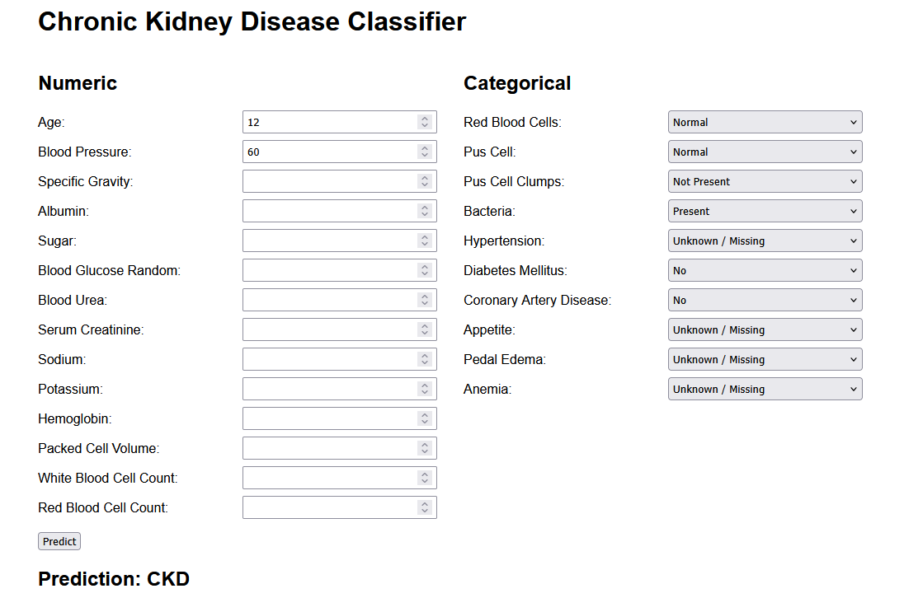

# Chronic Kidney Disease Classifier

End-to-end machine learning project for Chronic Kidney Disease classification, covering data preprocessing, model comparison, evaluation, API development, containerized deployment, and cloud deployment.



## Quick start

Install Git and Docker, and make sure Docker is running. The trained model is included; no training or local Python installation is required.

```bash
git clone https://github.com/mafaldamsmartinho/chronic-kidney-disease-classifier.git
cd chronic-kidney-disease-classifier
docker build -t ckd-classifier .
docker run --rm -p 8080:8080 ckd-classifier
```

Open [the classifier](http://localhost:8080), enter patient measurements using the displayed units, and click **Predict**. Leave unavailable values blank or select **Unknown / Missing**. Provide at least 13 of the 24 fields; otherwise, the result is **Undefined**. Predictions are **CKD** or **Not CKD**.

Developers can try the `/predict` endpoint through the [interactive API documentation](http://localhost:8080/docs). Stop the local server with `Ctrl+C`.

To host your own instance, follow [Google Cloud Deployment](#google-cloud-deployment) below.

## Tech Stack

Python · scikit-learn · FastAPI · Pydantic · pytest · Docker · Google Cloud Platform

## Model

The final model is an SVM (`SVC`) selected after comparing classification models using stratified cross-validation.

The saved pipeline includes:

- Data cleaning
- Missing-value imputation
- Numerical scaling
- Categorical encoding
- Trained classifier

Predictions:

- `1` — CKD
- `0` — Not CKD

## Results

The dataset contains 400 records: 320 for training and five-fold stratified cross-validation, and 80 for held-out testing. CKD is the positive class.

| SVM evaluation | Accuracy | Precision | Recall | F1 |
|---|---:|---:|---:|---:|
| Cross-validation mean | 1.00 | 1.00 | 1.00 | 1.00 |
| Held-out test | 1.00 | 1.00 | 1.00 | 1.00 |

## Limitations

These results come from one small dataset without external validation; perfect scores do not establish performance on new populations or suitability for clinical use. The API's 50% missing-input cutoff is an application rule, not a validated confidence threshold.

## Tests

```bash
pytest
```
## Google Cloud Deployment

The application was deployed to Google Cloud Run using Cloud Build and Artifact Registry.

The live service was removed after validation to avoid unnecessary cloud costs.

To deploy your own instance, install the Google Cloud CLI and use a Google Cloud project with billing enabled and permissions to enable APIs, manage IAM, build images, and deploy Cloud Run services. Run the commands from the cloned repository root. Cloud usage may incur charges; cleanup commands are included below.

Replace `<PROJECT_ID>` with your project ID and `<REGION>` with your chosen region (for example, `europe-west1`) throughout. See the [Cloud Run deployment guide](https://docs.cloud.google.com/run/docs/deploying) for required roles and organization-specific access restrictions.

### 1. Authenticate and select the Google Cloud project

```bash
gcloud auth login
```

```bash
gcloud config set project <PROJECT_ID>
```

### 2. Enable the required APIs

```bash
gcloud services enable run.googleapis.com
gcloud services enable artifactregistry.googleapis.com
gcloud services enable cloudbuild.googleapis.com
```

### 3. Create an Artifact Registry repository

```bash
gcloud artifacts repositories create ckd-repo --repository-format=docker --location=<REGION> --description="Docker repository for CKD classifier"
```

Check that the repository exists:

```bash
gcloud artifacts repositories list
```

### 4. Configure `.gcloudignore`

Use the included `.gcloudignore` to exclude notebooks, tests, caches, and the training dataset (`kidney_disease .csv`) from the upload. Keep `Dockerfile`, `requirements.txt`, `src/`, `api/`, `models/`, and `templates/`, which are required to build and run the application.

### 5. Check the Cloud Build service account

```bash
gcloud builds get-default-service-account
```

Replace `<SERVICE_ACCOUNT>` below with the service account email returned by the command (the part after `serviceAccounts/`, if a full resource name is shown).

Grant permission to read uploaded build files:

```bash
gcloud projects add-iam-policy-binding <PROJECT_ID> --member="serviceAccount:<SERVICE_ACCOUNT>" --role="roles/storage.objectViewer"
```

Grant permission to write Cloud Build logs:

```bash
gcloud projects add-iam-policy-binding <PROJECT_ID> --member="serviceAccount:<SERVICE_ACCOUNT>" --role="roles/logging.logWriter"
```

Grant permission to push images to Artifact Registry:

```bash
gcloud projects add-iam-policy-binding <PROJECT_ID> --member="serviceAccount:<SERVICE_ACCOUNT>" --role="roles/artifactregistry.writer"
```

### 6. Build and push the Docker image

Cloud Build uses the project Dockerfile to build the image and push it directly to Artifact Registry.

```bash
gcloud builds submit --tag <REGION>-docker.pkg.dev/<PROJECT_ID>/ckd-repo/ckd-app:latest
```

### 7. Deploy the image to Cloud Run

```bash
gcloud run deploy ckd-app --image <REGION>-docker.pkg.dev/<PROJECT_ID>/ckd-repo/ckd-app:latest --region <REGION> --port 8080 --platform managed --allow-unauthenticated
```

Open the HTTPS service URL printed by Cloud Run to use the same patient form. Append `/docs` to access the interactive API documentation. The `--allow-unauthenticated` flag makes this instance publicly accessible.

### 8. Delete the Cloud Run service

When finished with the deployment, remove the service:

```bash
gcloud run services delete ckd-app --region <REGION>
```

### 9. Delete the entire Artifact Registry repository

This deletes all images in `ckd-repo`; use it only when you no longer need that repository.

```bash
gcloud artifacts repositories delete ckd-repo --location=<REGION>
```


